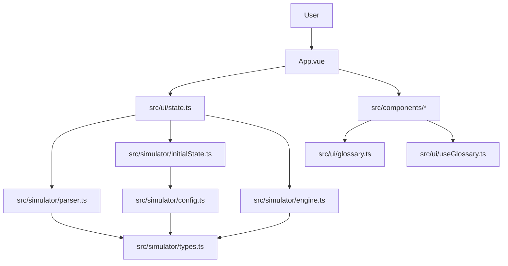
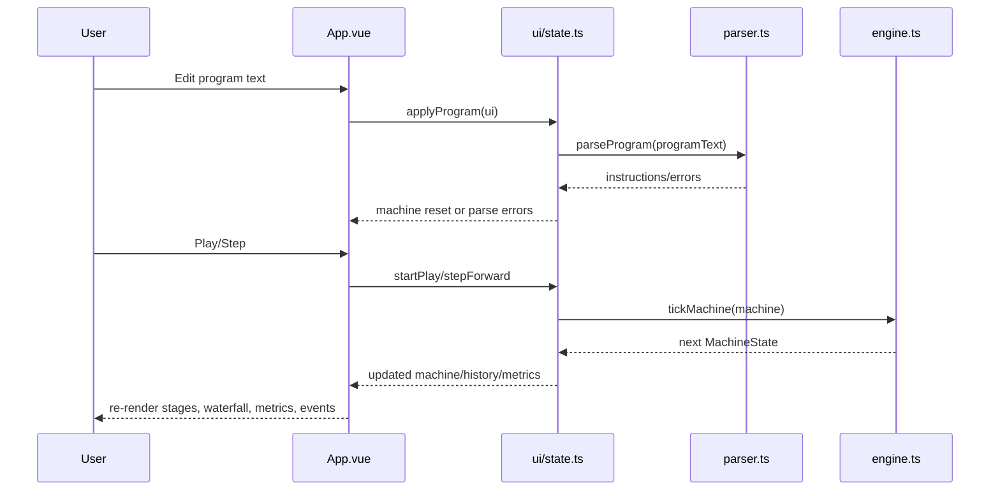

# Architecture Overview

## Beginner Primer
The app is a Vue-based instruction-pipeline simulator. A user enters assembly-like text, the parser turns it into typed instructions, the simulation engine advances one cycle at a time, and the UI renders snapshots as stage boxes, a waterfall table, metrics, and an event log.

Think in three layers:
1. Domain model and simulation semantics.
2. Simulation orchestration and lifecycle.
3. UI rendering and interactions.

## Practical Deep Dive

### Layered Module Structure
- Domain types: `src/simulator/types.ts`
- Defaults and constructors: `src/simulator/config.ts`, `src/simulator/initialState.ts`
- Input parsing: `src/simulator/parser.ts`
- Cycle stepping and hazard/forwarding logic: `src/simulator/engine.ts`
- UI state orchestration: `src/ui/state.ts`
- View orchestration: `src/App.vue`
- Shared glossary model and composable: `src/ui/glossary.ts`, `src/ui/useGlossary.ts`
- Rendering components: `src/components/*.vue`

### Component and Data Ownership

### Runtime Data Flow

## Design Invariants
1. `tickMachine` returns a new machine object each cycle (state progression is explicit).
2. History is append-only and cycle-indexed.
3. Pipeline stages are always exactly IF, ID, EX, MEM, WB.
4. UI playback uses latest state; timeline scrubbing is for historical display.
5. Parse errors block program application and preserve safety.

## Known Conceptual Pitfalls
1. Cycle 0 is initial machine state, not the first executed cycle.
2. `R0` writes are silently ignored.
3. Load-use hazard inserts one bubble when enabled.
4. Forwarding implemented is MEM->EX path semantics in this simplified model.
5. Completion requires exhausted PC and no in-flight stage occupancy.

## File Map for New Developers
- Start at `src/App.vue` to see top-level interactions.
- Move to `src/ui/state.ts` for lifecycle functions.
- Read `src/simulator/engine.ts` for execution behavior.
- Read `src/simulator/parser.ts` for accepted instruction grammar.
- Use component docs for UI behavior details.
