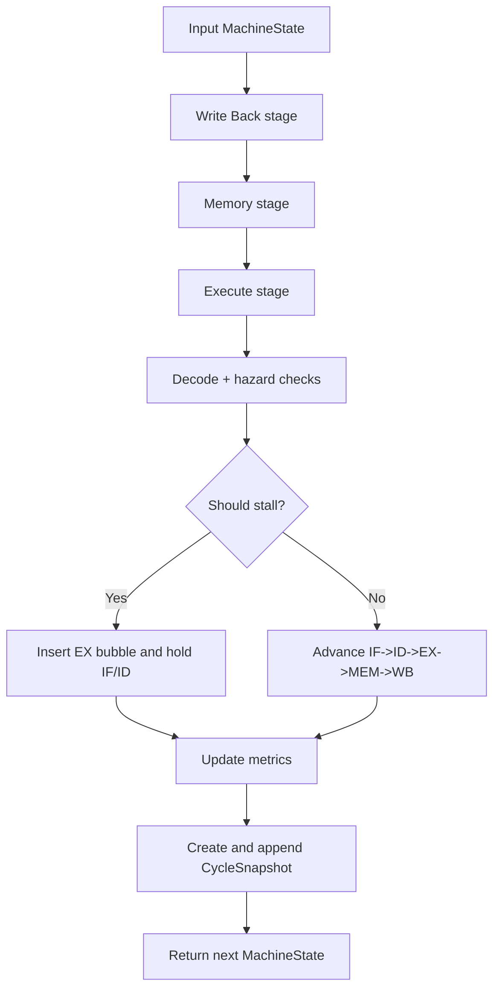
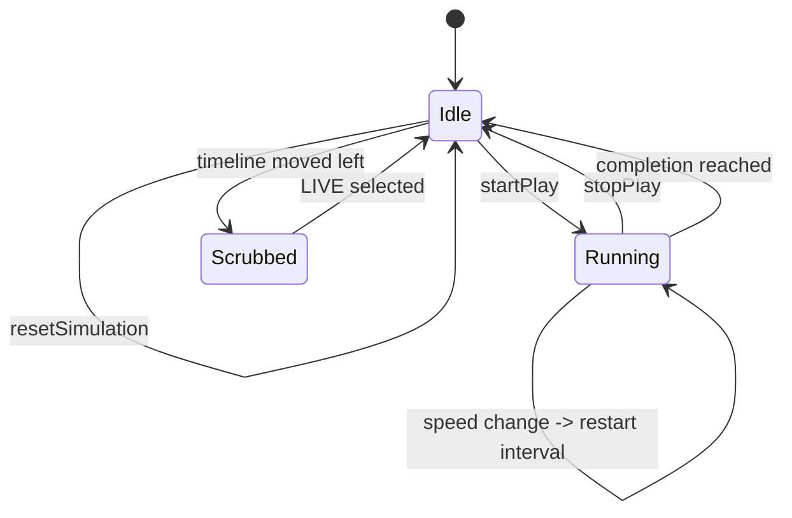
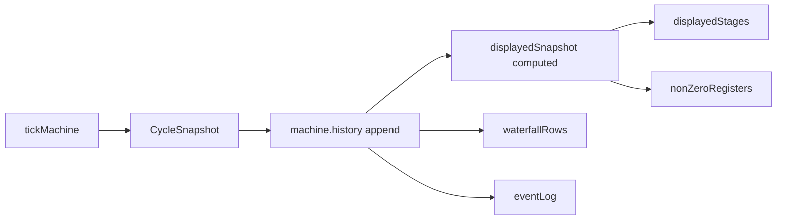

# Runtime Flow and Lifecycle

## Beginner Primer
The simulator advances in discrete ticks. Each tick emulates one hardware clock cycle. In each cycle, work happens in this order:
1. WB commits register writes.
2. MEM performs loads/stores.
3. EX performs ALU/address calculation (with forwarding when available).
4. ID checks hazards and may stall.
5. IF fetches next instruction if not stalled.

This strict order is why behavior is deterministic and replayable.

## Practical Deep Dive

### Tick Lifecycle

### UI Lifecycle State Machine

### Controls to State Function Mapping
- Play/Pause button: `handlePlayPause` -> `startPlay` or `stopPlay`.
- Step button: `handleStep` -> `stopPlay` then `stepForward`.
- Reset button: `handleReset` -> `resetSimulation`.
- Apply button: `handleApplyProgram` -> `applyProgram`.
- Config toggles: `handleConfigChange` -> `applyConfig`.
- Timeline range input: `scrubberValue` computed setter updates `selectedCycle`.

### Snapshot and Rendering Flow

## Hazard and Forwarding Evaluation Details
1. Load-use hazard checks ID consumers against EX load destination.
2. RAW hazard checks pending EX/MEM writes when forwarding is disabled.
3. Stall path injects bubble into EX and holds IF/ID.
4. Forwarding events are recorded and surfaced in overlays and event logs.

## Completion Criteria
A run is complete only when both are true:
1. `pc >= program.length`
2. all pipeline stages are empty

`isMachineComplete` enforces these jointly.
