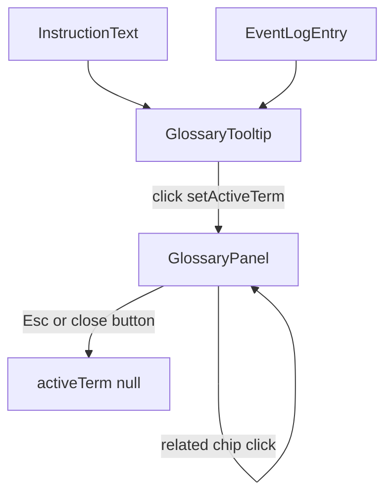

# Components and Interaction Flow Reference

Sources:
- `src/components/GlossaryTooltip.vue`
- `src/components/GlossaryPanel.vue`
- `src/components/InstructionText.vue`
- `src/components/EventLogEntry.vue`
- `src/components/HelloWorld.vue`
- `src/main.ts`

## Beginner Primer
Components are intentionally small and role-focused:
- `GlossaryTooltip` adds hover preview and click-to-open glossary navigation.
- `GlossaryPanel` renders full glossary content and related-term navigation.
- `InstructionText` tokenizes instruction text and links opcode to glossary.
- `EventLogEntry` safely renders event tags with glossary affordances.
- `HelloWorld` is scaffold/demo code and not used by the simulator UI.

## `GlossaryTooltip.vue`

### Props
- `term: string`

### Local state and computed
- `entry`: `computed(() => getEntry(props.term))`
- `isHovered`: `ref<boolean>`
- `wrapperEl`: `ref<HTMLElement | null>`
- `flipBelow`: `ref<boolean>`
- `tooltipId`: computed aria id (`glossary-tip-${term}`)

### Functions
- `handleMouseEnter()`
  - guards missing entry
  - measures wrapper top position
  - enables `flipBelow` when near viewport top (`rect.top < 120`)
  - sets hover open state
- `handleMouseLeave()` sets hover closed
- `handleClick(e)`
  - guards missing entry
  - stops propagation
  - sets active glossary term

### Behavior notes
- Hover only shows preview if entry exists.
- Click opens shared panel via composable state.
- Tooltip uses ARIA `aria-describedby` and `role=tooltip`.

## `GlossaryPanel.vue`

### Composable state
- Uses shared glossary composable values:
  - `activeTerm`
  - `setActiveTerm`
  - `getEntry`

### Computed
- `entry`: active glossary entry or null
- `isOpen`: boolean from `entry`

### Functions
- `close()` -> `setActiveTerm(null)`
- `handleKeydown(e)` closes on Escape

### Lifecycle hooks
- `onMounted` register window keydown listener
- `onUnmounted` unregister listener

### Behavior notes
- Uses Vue `Transition` with slide animation.
- Related-term chips call `setActiveTerm(rel)` for in-panel navigation.
- Mobile media query docks panel at bottom and full width.

## `InstructionText.vue`

### Props
- `rawText: string`

### Computed
- `parsed`
  - trims raw text
  - splits first token as opcode
  - keeps trailing substring as operands
  - annotates `hasEntry` if glossary contains opcode

### Behavior notes
- Opcode is wrapped in `GlossaryTooltip` only when entry exists.
- Handles blank text and opcode-only text safely.

## `EventLogEntry.vue`

### Props
- `ev: { cycle: number; kind: 'hazard' | 'forward'; text: string }`

### Computed
- `parts`
  - regex parses `C# [TAG] remainder`
  - maps tags to glossary keys:
    - `RAW` -> `RAW`
    - `LOAD_USE` -> `LOAD_USE`
    - `FWD` -> `forwarding`
  - returns tokenized parts for safe rendering without `v-html`

### Behavior notes
- Unknown/non-matching text is rendered plain.
- Tag token gets glossary tooltip when mapping exists.
- Class toggles styling by event kind.

## `HelloWorld.vue`

### Status
- Unused in current app composition.
- Not imported by `src/App.vue`.
- Contains default scaffold/demo UI with local `count` state.

### Recommendation
- Keep documented as non-production scaffold or remove in a separate cleanup commit.

## `src/main.ts`

### Purpose
- Entry point bootstrapping Vue app.

### Behavior
- Imports global stylesheet and root component.
- Executes `createApp(App).mount('#app')`.

## Interaction Flow Diagram

## Cross-Component Invariants
1. Glossary entry lookups are always guarded before rendering entry-dependent UI.
2. Tooltip/panel interaction is mediated only through `useGlossary` shared state.
3. Event log rendering avoids HTML injection by tokenized text rendering.
4. Component props are treated as immutable inputs.
