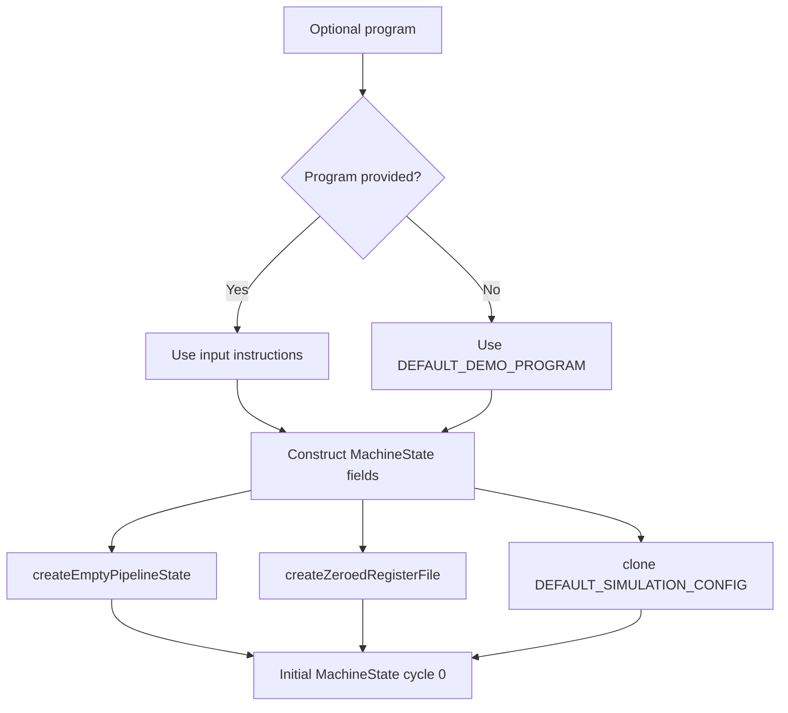

# Simulator Configuration and Initialization Reference

Sources:
- `src/simulator/config.ts`
- `src/simulator/initialState.ts`

## Beginner Primer
These modules answer two startup questions:
1. What does a fresh machine look like?
2. Which default behaviors (forwarding/hazard checks) are enabled?

If you want to change defaults, demo program content, or bootstrap behavior, start here.

## Practical Deep Dive

## `src/simulator/config.ts`

## Constant: `DEFAULT_SIMULATION_CONFIG`
- Kind: exported constant
- Value:
  - `enableForwarding: true`
  - `detectRawHazards: true`
  - `detectLoadUseHazards: true`
- Purpose: default runtime behavior for new machine states.
- Depends on: `SimulationConfig` type.
- Used by: `createInitialMachineState` in `src/simulator/initialState.ts`.

## Function: `createEmptyStage(stage)`
- Kind: exported function
- Signature:
```ts
createEmptyStage(stage: StageState['stage']): StageState
```
- Purpose: construct an unoccupied stage slot.
- Inputs:
  - `stage`: one of IF/ID/EX/MEM/WB.
- Output:
  - `{ stage, instructionId: null, isBubble: false }`
- Side effects: none.
- Used by: `createEmptyPipelineState`.

## Function: `createEmptyPipelineState()`
- Kind: exported function
- Signature:
```ts
createEmptyPipelineState(): PipelineState
```
- Purpose: create a fully empty 5-stage pipeline.
- Inputs: none.
- Output: IF/ID/EX/MEM/WB each initialized via `createEmptyStage`.
- Invariants:
  - Stage order follows `PIPELINE_STAGES` indices 0..4.
- Side effects: none.
- Used by: `createInitialMachineState`.

## Function: `createZeroedRegisterFile(registerCount = 32)`
- Kind: exported function
- Signature:
```ts
createZeroedRegisterFile(registerCount?: number): RegisterFile
```
- Purpose: generate register map with all values initialized to 0.
- Inputs:
  - `registerCount` default `32`.
- Output:
  - object containing keys `R0`..`R{registerCount-1}` with numeric zero values.
- Side effects: none.
- Edge cases:
  - non-standard counts produce correspondingly sized register ranges.
- Used by: `createInitialMachineState`.

## `src/simulator/initialState.ts`

## Constant: `DEFAULT_DEMO_PROGRAM`
- Kind: exported constant
- Type: `Instruction[]`
- Purpose: default program that demonstrates hazards and forwarding patterns.
- Instructions:
  1. `LW R1, 0(R0)`
  2. `ADDI R6, R0, 10`
  3. `ADD R2, R1, R6`
  4. `ADD R3, R2, R6`
  5. `SW R3, 4(R0)`
- Notes:
  - Chosen to produce meaningful event log and waterfall behavior.
  - IDs are pre-assigned 1..5.

## Function: `createInitialMachineState(program = DEFAULT_DEMO_PROGRAM)`
- Kind: exported function
- Signature:
```ts
createInitialMachineState(program?: Instruction[]): MachineState
```
- Purpose: produce a fresh machine state suitable for simulation start.
- Inputs:
  - optional instruction array; defaults to demo program.
- Output:
  - `MachineState` with:
    - `cycle = 0`
    - `pc = 0`
    - empty pipeline
    - empty transient results
    - zeroed register file
    - empty memory
    - empty history
    - zeroed metrics
    - cloned default config
- Side effects: none.
- Depends on:
  - `DEFAULT_SIMULATION_CONFIG`
  - `createEmptyPipelineState`
  - `createZeroedRegisterFile`
- Called by:
  - UI state initializer/reset/apply/config flows in `src/ui/state.ts`

## Initialization Flow Diagram


## Extension Guidance
1. If you add config flags, update both `SimulationConfig` and `DEFAULT_SIMULATION_CONFIG`.
2. Keep `createInitialMachineState` deterministic; avoid hidden randomness.
3. If demo program changes, re-check parser assumptions and UI defaults in `src/ui/state.ts`.
