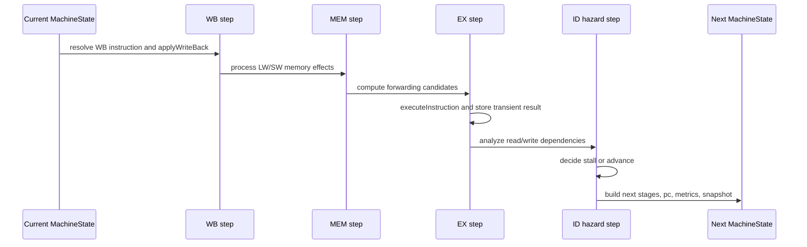

# Engine Reference

Source: `src/simulator/engine.ts`

## Beginner Primer
The engine is where simulation actually happens. One call to `tickMachine` advances exactly one cycle, updates stage occupancy, applies memory/register effects, records hazards/forwarding, updates metrics, and appends a snapshot.

## Exported API

### `isMachineComplete(machine)`
- Signature:
```ts
isMachineComplete(machine: MachineState): boolean
```
- Purpose: determine terminal state.
- Returns true only when:
  1. `pc >= program.length`
  2. all pipeline stages have `instructionId === null`
- Important: exhausted PC alone is insufficient because in-flight instructions may still be draining.

### `tickMachine(current)`
- Signature:
```ts
tickMachine(current: MachineState): MachineState
```
- Purpose: execute one deterministic cycle transition.
- Side effects: none on input object; returns next state.
- High-level stages:
  1. Clone mutable structures.
  2. WB commit.
  3. MEM load/store effects.
  4. EX compute with optional forwarding.
  5. ID hazard analysis and stall decision.
  6. IF fetch and stage transitions.
  7. Metrics/snapshot/history update.

## Internal Helper Functions

### `cloneRegisterFile(registerFile)`
- Purpose: immutable transition support.
- Returns shallow register map copy.

### `clonePipelineState(stages)`
- Purpose: copy all five stage objects.
- Used by snapshots to preserve historical state.

### `createStage(stage, instructionId, isBubble = false)`
- Purpose: canonical stage object constructor.
- Used by both stall and non-stall transition paths.

### `getInstructionById(program, instructionId)`
- Purpose: stage occupancy id -> instruction lookup.
- Returns `null` for empty stage or missing id.

### `readRegister(registerFile, registerName)`
- Purpose: safe register read with undefined fallback to zero.
- Returns `0` when register is undefined/null.

### `executeInstruction(instruction, registerFile, forwardedValues = {})`
- Purpose: ALU/address computation for current EX instruction.
- Opcode behavior:
  - `ADD`: `src1 + src2`
  - `SUB`: `src1 - src2`
  - `AND`: bitwise and
  - `OR`: bitwise or
  - `XOR`: bitwise xor
  - `ADDI`: `src1 + immediate`
  - `LW`/`SW`: address calc `src1 + immediate`
  - `NOP`: `0`
- Forwarding behavior:
  - helper `readSrc` prefers `forwardedValues[reg]` over registerFile.

### `applyWriteBack(instruction, registerFile, transientResults)`
- Purpose: commit WB-stage result into destination register.
- No-op cases:
  - no destination
  - `SW`
  - `NOP`
  - destination `R0`
- Otherwise writes `transientResults[instruction.id] ?? 0` to `registerFile[dst]`.

### `createSnapshot(cycle, pc, stages, registerFile, memoryDeltas, hazards, forwarding)`
- Purpose: construct immutable `CycleSnapshot`.
- Copies stage/register structures before storing.

### `getReadRegisters(instruction)`
- Purpose: dependency analysis helper for hazards/forwarding.
- Returns set of source registers read by instruction.
- Note: SW reads both base (`src1`) and store value (`src2`).

### `getWrittenRegister(instruction)`
- Purpose: dependency analysis helper.
- Returns destination register for instructions that write.
- Returns null for missing dst, SW, or NOP.

## Tick Algorithm Detail

### 1. Initialize cycle-local mutable copies
- `nextCycle = current.cycle + 1`
- clone register file, memory, transientResults
- initialize empty `memoryDeltas`, `hazards`, `forwardingEvents`

### 2. WB stage
- Resolve instruction currently in WB.
- Apply write-back if eligible.
- Remove committed instruction entry from transient results.

### 3. MEM stage
- For `LW`: treat transient result as address, read memory into transient result.
- For `SW`: treat transient result as address, write register value to memory, record `MemoryDelta`, remove transient result entry.

### 4. EX stage and forwarding
- Resolve instruction in EX.
- If forwarding enabled, compare EX reads to MEM write destination.
- On match, inject forwarded value and record `ForwardingEvent`.
- Execute EX instruction and store result into transient results.

### 5. ID hazard checks
- Resolve instruction in ID and read-set.
- Compute write destinations from EX and MEM instructions.
- Detect load-use hazard:
  - enabled flag true
  - EX instruction is LW
  - ID reads EX write destination
- Detect RAW hazard without forwarding:
  - raw detection enabled
  - forwarding disabled
  - ID reads pending write in EX or MEM
- Emit hazard events with cycle/type/description and instruction IDs.

### 6. Stall decision and stage transition
- `shouldStall = hasLoadUseHazard || hasRawHazardWithoutForwarding`
- Fetch behavior:
  - stall: no fetch and `pc` unchanged
  - non-stall: fetch at current `pc`, increment if fetched
- Stage transition behavior:
  - stall path:
    - `WB <- MEM`
    - `MEM <- EX`
    - `EX <- bubble`
    - `ID` held
    - `IF` held
  - non-stall path:
    - `WB <- MEM`
    - `MEM <- EX`
    - `EX <- ID`
    - `ID <- IF`
    - `IF <- fetched`

### 7. Metrics, snapshot, and return
- Committed instruction count increments for WB non-NOP instructions.
- `cycles` increments by one.
- `cpi = cycles / committedInstructions` with zero guard.
- `stallCount` increments on stall.
- `bubbleCount` increments by bubble stages in next pipeline.
- `forwardingCount` increments by number of forwarding events this cycle.
- Append snapshot to history and return updated machine object.

## Tick Sequence Diagram


## Hazard and Forwarding Semantics
1. RAW hazard stalling applies only when forwarding is disabled.
2. Load-use hazard can stall independently of RAW forwarding setting.
3. WB stage commits before hazard checks, so WB writes are visible and not treated as pending hazards in that cycle.
4. Forwarding events are currently generated for MEM->EX path matching read dependencies.

## Extension Notes
1. Add new opcodes in `executeInstruction` and ensure parser/types are updated.
2. If adding new forwarding paths, update event model and overlay assumptions.
3. If adding structural/control hazards, update hazard detection and documentation in lockstep.
