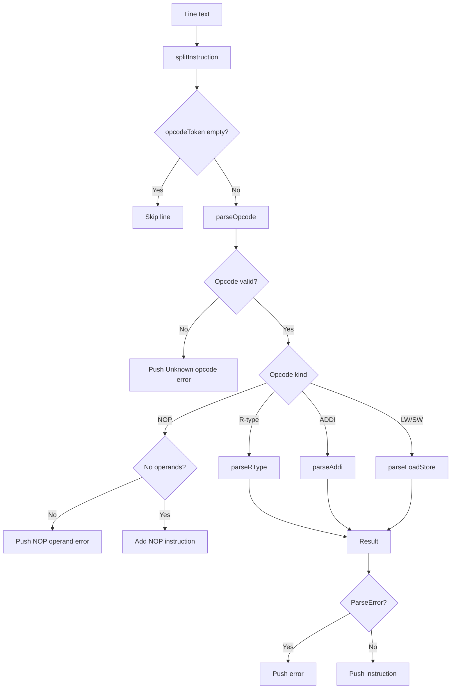

# Parser Reference

Source: `src/simulator/parser.ts`

## Beginner Primer
`parseProgram` transforms multi-line user text into typed instruction objects. It also returns structured parse errors instead of throwing, so the UI can present user-friendly feedback.

## Accepted Instruction Forms
- R-type: `ADD dst, src1, src2`, `SUB`, `AND`, `OR`, `XOR`
- Immediate: `ADDI dst, src1, imm`
- Memory:
  - `LW dst, offset(base)`
  - `SW src, offset(base)`
- `NOP` with no operands
- Comments: `# ...` end-of-line comments are ignored.

## Practical Deep Dive

## Interfaces

### `ParseError`
- Fields:
  - `line: number`
  - `message: string`
  - `source: string`
- Purpose: report parser failures without exceptions.

### `ParseProgramResult`
- Fields:
  - `instructions: Instruction[]`
  - `errors: ParseError[]`
- Purpose: return parsed output and diagnostics together.

## Internal Constants

### `OPCODE_SET`
- Kind: internal constant
- Purpose: legal opcode lookup for `parseOpcode`.
- Values: ADD, SUB, AND, OR, XOR, ADDI, LW, SW, NOP.

### `REGISTER_PATTERN`
- Kind: internal regex constant
- Value: `/^R([0-9]|[12][0-9]|3[01])$/`
- Purpose: enforce register tokens in range R0..R31.

### `MEMORY_PATTERN`
- Kind: internal regex constant
- Value: `/^(-?\d+)\((R(?:[0-9]|[12][0-9]|3[01]))\)$/`
- Purpose: parse memory operands like `4(R0)` or `-8(R15)`.

## Internal Helper Functions

### `parseRegister(token)`
- Signature:
```ts
parseRegister(token: string): RegisterName | null
```
- Purpose: uppercase-normalize and validate register syntax.
- Returns: register token or `null`.

### `parseOpcode(token)`
- Signature:
```ts
parseOpcode(token: string): Opcode | null
```
- Purpose: uppercase-normalize and validate opcode membership.

### `parseImmediate(token)`
- Signature:
```ts
parseImmediate(token: string): number | null
```
- Purpose: validate signed integer literal and parse base-10 numeric value.

### `splitInstruction(rawLine)`
- Signature:
```ts
splitInstruction(rawLine: string): { opcodeToken: string; argTokens: string[] }
```
- Purpose:
  - strip trailing comments
  - split opcode from comma-delimited operands
  - trim and drop empty operand tokens
- Edge behavior:
  - blank/comment-only lines return empty opcode and args.

### `parseRType(id, opcode, rawText, lineNumber, argTokens)`
- Purpose: parse and validate 3-register instructions.
- Valid opcodes: ADD/SUB/AND/OR/XOR.
- Error conditions:
  - incorrect operand count
  - invalid register names

### `parseAddi(id, rawText, lineNumber, argTokens)`
- Purpose: parse `ADDI dst, src1, immediate`.
- Error conditions:
  - incorrect operand count
  - invalid register(s)
  - invalid immediate format

### `parseLoadStore(id, opcode, rawText, lineNumber, argTokens)`
- Purpose: parse LW/SW memory forms.
- Validation:
  - exactly two operands
  - first operand register valid
  - second operand matches `offset(base)` pattern
  - base register valid
- Construction behavior:
  - LW maps register to `dst`, base to `src1`
  - SW maps base to `src1`, value register to `src2`

## Exported Function

### `parseProgram(programText)`
- Signature:
```ts
parseProgram(programText: string): ParseProgramResult
```
- Purpose: full program parse pipeline.
- High-level algorithm:
  1. Split input into lines.
  2. For each line, run `splitInstruction`.
  3. Skip empty/comment-only lines.
  4. Validate opcode via `parseOpcode`.
  5. Dispatch to opcode-specific parser.
  6. Collect either `Instruction` or `ParseError`.
  7. Assign monotonically increasing IDs for successfully parsed instructions.
- Output behavior:
  - partial success allowed: valid instructions can coexist with errors.

## Parse Dispatch Diagram


## Failure Modes and Edge Cases
1. Unknown opcodes produce line-specific errors.
2. `NOP` with operands is rejected.
3. Register names outside R0..R31 are rejected.
4. Memory operand must match exact `offset(base)` syntax.
5. Immediate parsing only accepts integer literals.
6. Parser is case-insensitive for opcode and register tokens.

## Callers and Dependencies
- Called by:
  - `resetSimulation` in `src/ui/state.ts`
  - `applyProgram` in `src/ui/state.ts`
- Depends on:
  - instruction/type models from `src/simulator/types.ts`
