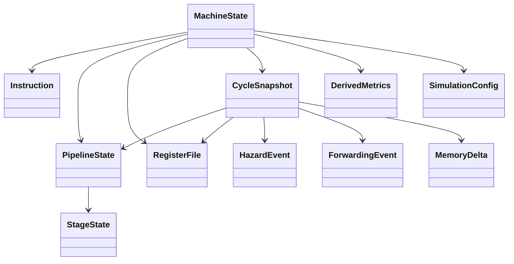

# Simulator Types and Constants Reference

Source: `src/simulator/types.ts`

## Beginner Primer
This file defines the simulator vocabulary. Every other simulator module relies on these types. If you are new to the codebase, read this file first so stage names, instruction fields, snapshot data, and metrics all have clear meaning.

## Practical Deep Dive

## Constant: `PIPELINE_STAGES`
- Kind: exported global constant
- Value: `['IF', 'ID', 'EX', 'MEM', 'WB']`
- Purpose: canonical stage ordering and stage key source.
- Invariants:
  - Order is fixed and used by rendering and state construction.
  - `PipelineStage` derives directly from this constant.
- Used by:
  - `createEmptyPipelineState` in `src/simulator/config.ts`
  - stage iteration in `src/App.vue`

## Type: `PipelineStage`
- Kind: exported union type derived from `PIPELINE_STAGES`
- Shape: `'IF' | 'ID' | 'EX' | 'MEM' | 'WB'`
- Purpose: constrain stage keys in records/events.

## Type: `Opcode`
- Kind: exported union type
- Shape: `'ADD' | 'SUB' | 'AND' | 'OR' | 'XOR' | 'ADDI' | 'LW' | 'SW' | 'NOP'`
- Purpose: define all legal instruction operations for parser/engine.

## Type: `RegisterName`
- Kind: exported template-literal type
- Shape: ``R${number}``
- Purpose: represent logical register keys across parser, engine, snapshots.
- Constraint note: parser currently validates R0-R31; the type allows broader numeric forms at compile time.

## Interface: `Instruction`
- Kind: exported interface
- Purpose: normalized parsed instruction representation.
- Fields:
  - `id: number` unique per parsed program.
  - `opcode: Opcode` operation selector.
  - `dst?: RegisterName` destination register where applicable.
  - `src1?: RegisterName` primary source or base register.
  - `src2?: RegisterName` secondary source or store-value register.
  - `immediate?: number` immediate or offset.
  - `memoryAddress?: number` optional precomputed address slot (reserved).
  - `rawText: string` original textual instruction form.
- Invariants:
  - `NOP` has only `id`, `opcode`, `rawText`.
  - `SW` does not use `dst`.

## Interface: `StageState`
- Kind: exported interface
- Purpose: represent one pipeline slot occupancy.
- Fields:
  - `stage: PipelineStage`
  - `instructionId: number | null`
  - `isBubble: boolean`
- Invariants:
  - `instructionId === null` means empty stage.
  - `isBubble` marks inserted bubble semantics for visualization/metrics.

## Type: `PipelineState`
- Kind: exported record type
- Shape: `Record<PipelineStage, StageState>`
- Purpose: full 5-stage pipeline occupancy at a cycle boundary.

## Type: `RegisterFile`
- Kind: exported record type
- Shape: `Record<RegisterName, number>`
- Purpose: integer register value map.

## Interface: `HazardEvent`
- Kind: exported interface
- Purpose: structured hazard reporting per cycle.
- Fields:
  - `cycle: number`
  - `type: 'RAW' | 'LOAD_USE' | 'STRUCTURAL'`
  - `stage: PipelineStage`
  - `description: string`
  - `blockingInstructionId?: number`
  - `blockedInstructionId?: number`

## Interface: `ForwardingEvent`
- Kind: exported interface
- Purpose: structured forwarding trace for overlays/logging.
- Fields:
  - `cycle: number`
  - `fromStage: 'EX' | 'MEM' | 'WB'`
  - `toStage: 'ID' | 'EX'`
  - `register: RegisterName`
  - `value: number`

## Interface: `MemoryDelta`
- Kind: exported interface
- Purpose: capture one memory write effect in a cycle.
- Fields:
  - `address: number`
  - `before: number`
  - `after: number`

## Interface: `CycleSnapshot`
- Kind: exported interface
- Purpose: immutable timeline entry used by UI and scrubber.
- Fields:
  - `cycle: number`
  - `pc: number`
  - `stages: PipelineState`
  - `registerFile: RegisterFile`
  - `memoryDeltas: MemoryDelta[]`
  - `hazards: HazardEvent[]`
  - `forwarding: ForwardingEvent[]`

## Interface: `DerivedMetrics`
- Kind: exported interface
- Purpose: summarized performance and behavior counters.
- Fields:
  - `cycles: number`
  - `committedInstructions: number`
  - `cpi: number`
  - `stallCount: number`
  - `bubbleCount: number`
  - `forwardingCount: number`

## Interface: `SimulationConfig`
- Kind: exported interface
- Purpose: runtime switches for hazard/forwarding behavior.
- Fields:
  - `enableForwarding: boolean`
  - `detectRawHazards: boolean`
  - `detectLoadUseHazards: boolean`

## Interface: `MachineState`
- Kind: exported interface
- Purpose: complete simulator state container.
- Fields:
  - `cycle: number`
  - `pc: number`
  - `program: Instruction[]`
  - `stages: PipelineState`
  - `transientResults: Record<number, number>`
  - `registerFile: RegisterFile`
  - `memory: Record<number, number>`
  - `history: CycleSnapshot[]`
  - `metrics: DerivedMetrics`
  - `config: SimulationConfig`

## Relationship Diagram

## Edge Cases to Remember
1. `RegisterName` type is broad but parser constraints are narrower.
2. `STRUCTURAL` exists in hazard type union but is not currently emitted by `tickMachine`.
3. `memoryAddress` exists on `Instruction` but is not currently populated by parser.
