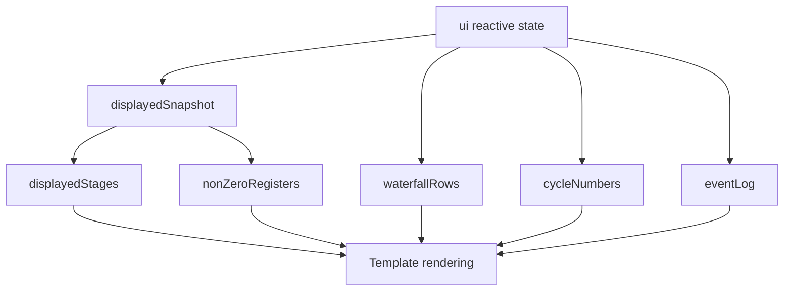

# App Root Orchestration Reference

Source: `src/App.vue`

## Beginner Primer
`App.vue` is the orchestration layer: it wires UI controls to state actions, converts machine history into renderable structures, and composes all visualization panels.

## Top-Level Responsibilities
1. Own a reactive `ui` object from `createInitialUiState()`.
2. Manage lifecycle cleanup for interval timers.
3. Compute displayed views from machine state/history.
4. Provide event handlers for controls and config toggles.
5. Render stage view, timeline, editor, metrics, waterfall, register file, and event log.

## Imports and Component Dependencies
- State actions: `applyConfig`, `applyProgram`, `createInitialUiState`, `resetSimulation`, `startPlay`, `stepForward`, `stopPlay`
- Domain constants: `PIPELINE_STAGES`
- Types: `CycleSnapshot`
- Child components: `GlossaryTooltip`, `GlossaryPanel`, `InstructionText`, `EventLogEntry`

## Reactive Constant: `ui`
- Kind: module-level reactive state object
- Initialization:
```ts
const ui = reactive(createInitialUiState());
```
- Purpose: single source of truth for all root UI state.

## Lifecycle Hook: `onUnmounted`
- Behavior: clears `ui.intervalId` when component is destroyed.
- Purpose: avoid leaked timers.

## Watcher: `watch(() => ui.tickMs, ...)`
- Trigger: speed slider updates `tickMs`.
- Behavior while running:
  1. call `stopPlay(ui)`
  2. reassign `ui.tickMs` from new value
  3. restart with `startPlay(ui)`
- Purpose: apply speed changes immediately during playback.

## Computed Values

### `displayedSnapshot`
- Type: `computed<CycleSnapshot | null>`
- Purpose: choose snapshot currently shown in stage/overlay panels.
- Rules:
  - no history -> `null`
  - `selectedCycle === null` -> latest history entry
  - otherwise find matching cycle; fallback to latest if missing

### `displayedStages`
- Purpose: map IF..WB into render-ready stage rows.
- Output per stage:
  - `stage`
  - `slot` (`StageState`)
  - `label` (`BUBBLE`, instruction text, or em dash)

### `waterfallRows`
- Purpose: build instruction-by-cycle table model.
- Optimization:
  - precompute `cycleToSnapshot` map to avoid repeated history scans.
- Cell model:
  - `stage` string
  - `type`: `active | bubble | stall | forward | empty`
- Semantics:
  - active stage plus forwarding event -> `forward`
  - active stage plus blocked hazard -> `stall`

### `cycleNumbers`
- Purpose: table header cycle list from history.

### `nonZeroRegisters`
- Purpose: compact register panel listing only non-zero values.
- Data source: displayed snapshot register file if scrubbed; otherwise live register file.

### `eventLog`
- Purpose: unified event feed for hazard + forwarding records.
- Behavior:
  - iterates all history snapshots
  - flattens hazards and forwarding with formatted text
  - keeps most recent 24 entries and reverses order

### `scrubberMax`
- Purpose: timeline upper bound (`history.length`, minimum 0).

### `scrubberValue`
- Purpose: two-way mapping between range-input index and selected cycle.
- Getter behavior:
  - live mode returns max
  - scrubbed mode returns index+1 of selected cycle
- Setter behavior:
  - value at max -> live mode (`selectedCycle = null`)
  - otherwise map index to cycle id in history

### `displayedCycle`
- Purpose: cycle label for UI header and stage section.
- Source: displayed snapshot cycle if available else machine cycle.

## Event Handlers

### `handlePlayPause()`
- If running -> stop.
- Else -> start.

### `handleStep()`
- Stop playback then execute one tick.

### `handleReset()`
- Delegate to `resetSimulation(ui)`.

### `handleApplyProgram()`
- Delegate to `applyProgram(ui)`.

### `handleConfigChange(key, value)`
- Key union:
  - `enableForwarding`
  - `detectRawHazards`
  - `detectLoadUseHazards`
- Behavior: delegates partial config update via `applyConfig(ui, { [key]: value })`.

## Template Regions and Their Data Sources
1. Header badges -> `displayedCycle`
2. Controls bar -> handlers + `ui.tickMs` + config flags
3. Stage boxes and overlays -> `displayedStages`, `displayedSnapshot.forwarding/hazards`
4. Timeline scrubber -> `scrubberValue`, `scrubberMax`, `selectedCycle`
5. Program editor/errors -> `ui.programText`, `ui.parseErrors`
6. Metrics cards -> `ui.machine.metrics`
7. Waterfall table -> `waterfallRows`, `cycleNumbers`
8. Register panel -> `nonZeroRegisters`
9. Event log -> `eventLog`
10. Glossary side panel -> `GlossaryPanel`

## Styling and Responsiveness (Scoped CSS)
- Defines layout tokens and panel styling in component scope.
- Breakpoints:
  - `max-width: 900px` switches two-column layout to one column.
  - `max-width: 768px` refactors controls and card grids for tablet.
  - `max-width: 600px` increases touch/readability for mobile.
- Accessibility:
  - focus-visible outlines for interactive controls
  - reduced-motion media query disables transitions/animations

## Render Flow Diagram


## Edge Cases
1. Selected cycle not found in history falls back to latest snapshot.
2. Scrubber value uses one-based indexing relative to history array positions.
3. Event log is capped at 24 entries for readability.
4. Stage labels render em dash when no instruction occupies stage.
