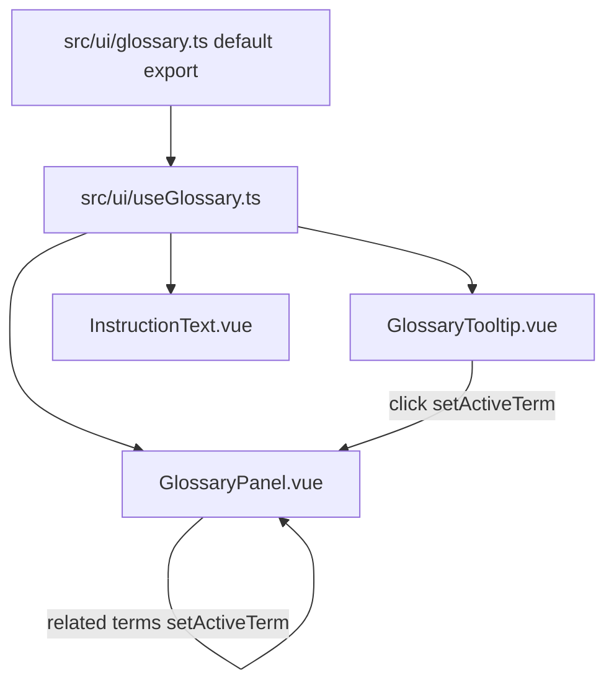

# Glossary Data and Composable Reference

Sources:
- `src/ui/useGlossary.ts`
- `src/ui/glossary.ts`

## Beginner Primer
The glossary system provides contextual teaching in the UI. Hover shows quick previews, click opens a rich side panel. Data and state are intentionally centralized so all components share the same glossary context.

## `src/ui/glossary.ts`

## Interface: `GlossaryEntry`
- Kind: exported interface
- Fields:
  - `term: string`
  - `category: string`
  - `preview: string`
  - `definition: string`
  - `syntax?: string`
  - `example?: string`
  - `diagram?: string`
  - `relatedTerms?: string[]`
- Purpose: schema for one glossary card.

## Constant: `glossary`
- Kind: internal module constant
- Type: `Record<string, GlossaryEntry>`
- Purpose: full glossary dictionary keyed by glossary id.
- Coverage groups:
  - Pipeline stages (IF, ID, EX, MEM, WB)
  - Opcodes (ADD, SUB, AND, OR, XOR, ADDI, LW, SW, NOP)
  - Hazards and forwarding (RAW, LOAD_USE, forwarding, MEM_EX_Forward)
  - Metrics and concepts (CPI, stall, bubble, Pipeline, ILP, PC, RegisterFile, ZeroRegister)
  - Config flags (enableForwarding, detectRawHazards, detectLoadUseHazards)
  - Assembly formats (R-type, I-type, immediate, MemoryFormat)
  - UI terms (WaterfallDiagram, TimelineScrubber)

## Export: `default glossary`
- Kind: default export
- Purpose: canonical glossary dataset consumed by composable.

## `src/ui/useGlossary.ts`

## Constant: `activeTerm`
- Kind: internal module-level reactive constant
- Type: `ref<string | null>`
- Purpose: globally shared selected glossary term.
- Important behavior:
  - module-level singleton; shared across all composable callers.

## Function: `setActiveTerm(id)`
- Signature:
```ts
setActiveTerm(id: string | null): void
```
- Purpose: mutate currently selected glossary term.
- Side effects: writes to shared `activeTerm` ref.

## Function: `getEntry(id)`
- Signature:
```ts
getEntry(id: string): GlossaryEntry | undefined
```
- Purpose: lookup glossary entry by key.
- Returns `undefined` for unknown keys.

## Function: `useGlossary()`
- Signature:
```ts
useGlossary(): {
  activeTerm: Ref<string | null>;
  setActiveTerm(id: string | null): void;
  getEntry(id: string): GlossaryEntry | undefined;
}
```
- Purpose: expose shared glossary state and lookups to components.
- Called by:
  - `src/components/GlossaryTooltip.vue`
  - `src/components/GlossaryPanel.vue`
  - `src/components/InstructionText.vue`

## Shared-State Diagram


## Edge Cases
1. Unknown keys safely return `undefined`.
2. Because state is module-level, opening one term affects all glossary-aware components.
3. Components must guard on missing entries before rendering term-specific UI.
